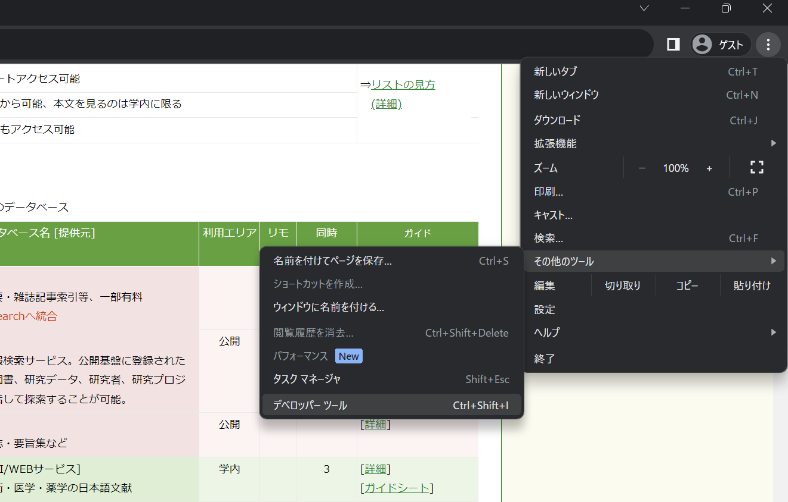
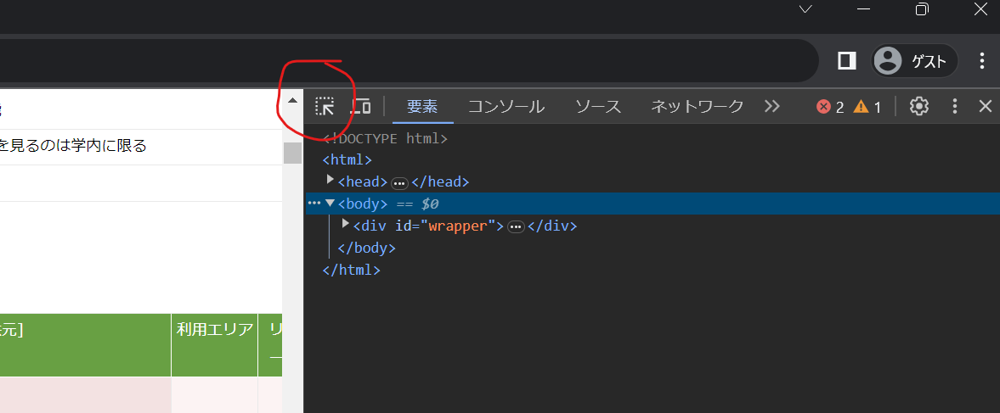
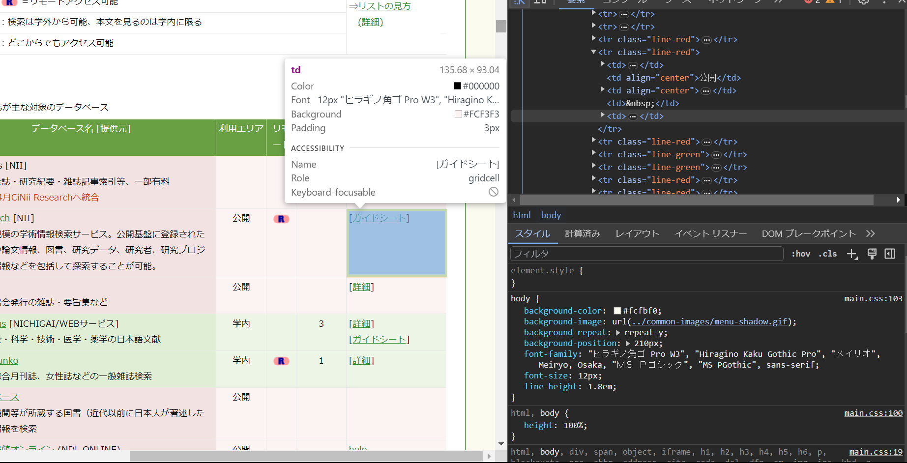
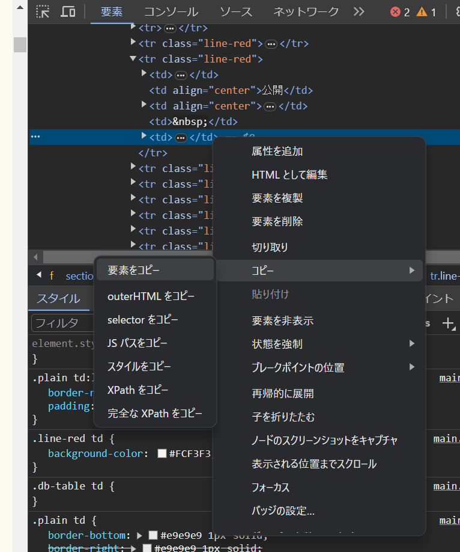

# データ作成のお願い

## どういった課題があるのか

- 名古屋大学図書館のホームページでは、論文や電子書籍などにアクセスできるウェブサイト、「データベース」のリンクや使い方をまとめたページ（便宜上「データベース集」と呼ぶ）があります。
- このデータベース集にはABC順に表示しているページ、カテゴリ別に表示しているページ、名前だけ羅列したページがあります。
- こういったページを表示する仕組みは本来、シングルソースを真として、その派生として各ページを自動的に生成するべきです。
- しかし、現在はそれぞれのページを手動で更新しており、一部変更の抜け漏れであったり、情報の整合性が保たれていない、または、保つために大きな労力が必要となってしまうという問題があります。

## どういった形で解決するのか

- Single Source of Truthとしてデータベース集を再編成する
- HTMLを自動生成する

## なにをしてほしいのか

- https://www.nul.nagoya-u.ac.jp/db/index.html にアクセスし、データを取得する
- 指定のxlsxに記述する。

このデータをSingle source of Truthとして、各種ページを生成します。

## 具体的な手順

- xlsxを開きます。（要リンク）
- `database`シートへ、各行に一つずつデータベースの情報を入力します。アルファベット順のページからデータを取得してください。
- 各カラムの意味は以下の通りです。

|カラム名|説明|
|-|-|
|id|一意な値。基本的に上から連番を採番するが、厳密に連番である必要はない。|
|name|日本語ページにおけるタイトル|
|name_en|英語ページにおけるタイトル|
|is_available_remote|リモートで利用可能か否か|
|available_area_id|現在のページでは、背景色と「利用エリア」カラムの表示によって利用できる場所を表示しています。背景色によって「学内でのみ利用可能」「検索は学外から可能、本文を見るのは学内に限る」「どこからでもアクセス可能」のいずれかを表し、「利用エリア」カラムによって、より詳細なエリアを示すことになっています。いいかえると、背景色と「利用エリア」カラムの組み合わせによって利用できる場所を示しています。`available_area`シートの中でこれらの組み合わせを定義しておき、この`avaialbe_area`シートにおけるidをこのカラムに入力してください。|
|simultaneous_connections|「同時接続」カラム。空白の場合は何も入力しないでください。|
|description|日本語ページにおけるデータベースの説明文。「	AAS Historical Periodicals Collection: Series 1」の場合は、「[EBSCOhost] 1691 年から 1820 年に出版された 500 誌を収録」が説明文にあたる。|
|description_en|英語ページにおけるデータベースの説明文。日本語と同じ。|
|note|ガイド[ガイドシート]のカラムの内容を表示。HTMLで記述する。|
|note_en|英語ページにおける「note」|
|provider|タイトルに「文学部提供」などと記載がある場合に入力する。なにもなければ何も入力しないでください。|
|provider_en|英語ページにおけるproviderの記述。|
|category_id|分野カラムに対応する。対応する分野のidを`category`シートから探して記入する。「	AAS Historical Periodicals Collection: Series 1」の場合は、分野に「社会科学」で、`category`シートで社会科学はid=4なので4を入力する。複数ある場合はカンマ区切りで入力する。例えば「総合分野」と「社会科学」があれば、それぞれidは1と4なので`1,4`と入力する。|
|initial|データベースの名前の頭文字。日本語の場合は発音に対応するもの。|

## ガイドのコピーの仕方

ガイドだけは入力する方法が特殊です。

1. 開発者ツールを開きます。F12を押すか、右側3点リーダーから「その他のツール」>「デベロッパーツール」から開くことが出来ます。
2. ページ内の要素にカーソルを合わせると該当箇所が見つかるモードを起動します。開発者ツールタブの左上にあるボタンをクリックしてください。
3.コピーしたいガイドの項目にカーソルを合わせます。
1. コピーします。<td>...</td>にカーソルを合わせてコピーを選択します。
2. 一旦メモ帳などに貼り付けます。
3. メモ帳でコピーしたときに付いてきた <td>と</td>を削除します。例えばコピーしたものが `<td>[<a href="../guide/gsheets/index.html#3">ガイドシート</a>]</td>`だった場合、 `[<a href="../guide/gsheets/index.html#3">ガイドシート</a>]`になるようにします。
